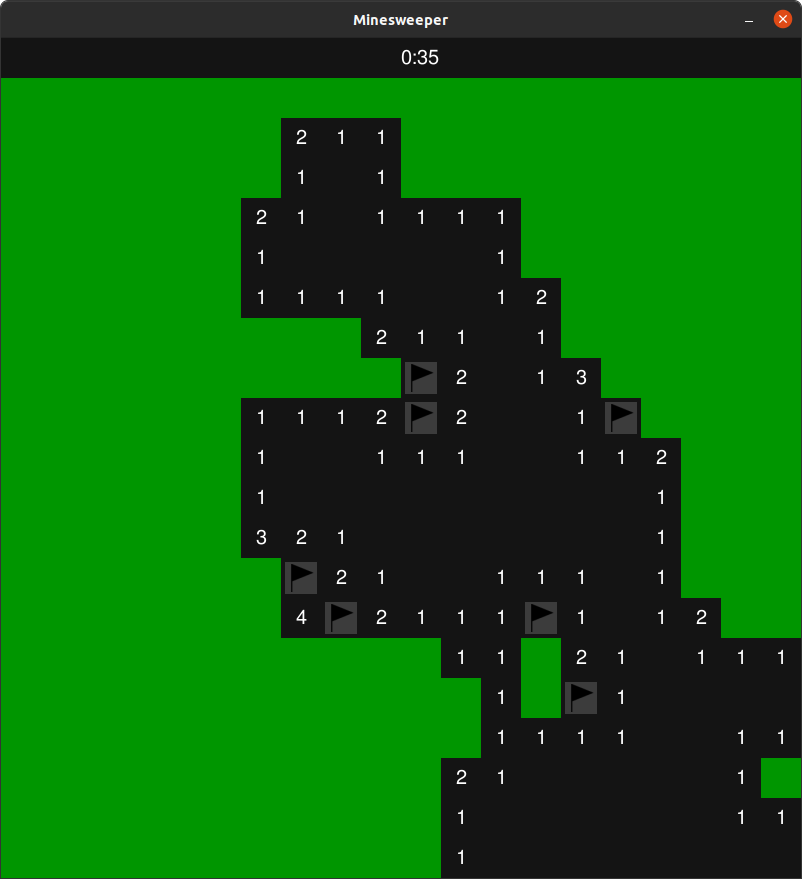

# Minesweeper
[Minesweeper.py](Minesweeper.py): 
 - A simple version of Minesweeper built on [Python 3](https://www.python.org) + [Pygame](https://www.pygame.org) + [Pygame_Menu](https://github.com/ppizarror/pygame-menu)

### To Do:
   
- Game end state:
    
  - [ ] Game over screen
  - [ ] Game win screen
    
- Game statistics:
    
  - [x] Time
  - [ ] Number of mines remaining
  - [ ] Total Flags and total number of mines
  - [ ] Dimentions
    
- Mine generation overhaul:
    
  - [ ] Make sure mines spawn in completable formations (for example 9 mines in a 3x3 space is impossible)
        
- Difficulties:
    
  - [x] Mine densities ect
        
- Graphics overhaul:

  - [ ] Create animations for flagging and uncovering,
  - [ ] Create different colour themes
